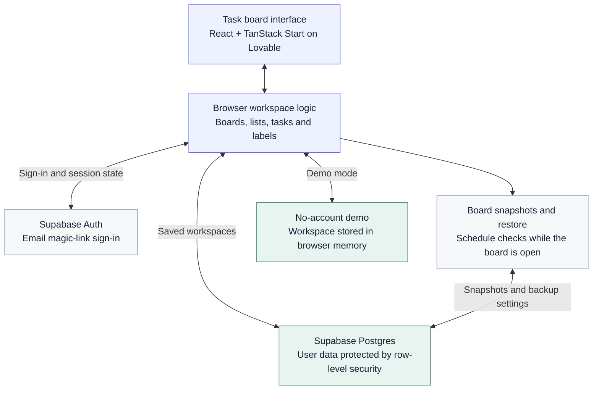

# DoneZone

A calm place for your tasks, projects, and next wins.

**[Open DoneZone](https://donezone-by-khiz.lovable.app)**

DoneZone brings boards, flexible lists, and task cards together in one focused workspace. Add context, due dates, and color labels; move work through your day; and keep completed work within reach through archives and backups.

**Project status:** published on Lovable. Explore the app through the live link above, including the no-account demo.

## Highlights

- Multiple boards with draggable lists and tasks.
- Clear due-date urgency and automatic due-date sorting.
- Custom color labels and one-click board filtering.
- Task notes, completion, copying, moving, and archive/restore.
- Board backup history and configurable automatic backup schedules while a board is open.
- Email sign-in, a no-account demo, and light/dark themes.
- Responsive layouts with locally hosted Plus Jakarta Sans.

## Architecture

Signed-in workspaces use Supabase authentication and access-controlled storage. Demo actions stay in browser memory. Automatic backup checks run while a signed-in board is open and visible; they are not an unattended server job.

The front end is built for Lovable with React and TanStack Start. The implementation is maintained in a separate private GitHub repository. Supabase provides authentication and access-controlled storage.

**This public repository contains documentation only.** It does not contain application source, build output, credentials, backend configuration, or user data.

Explore [features](FEATURES.md) and [design and architecture](ARCHITECTURE.md).

Built by Khizer.
